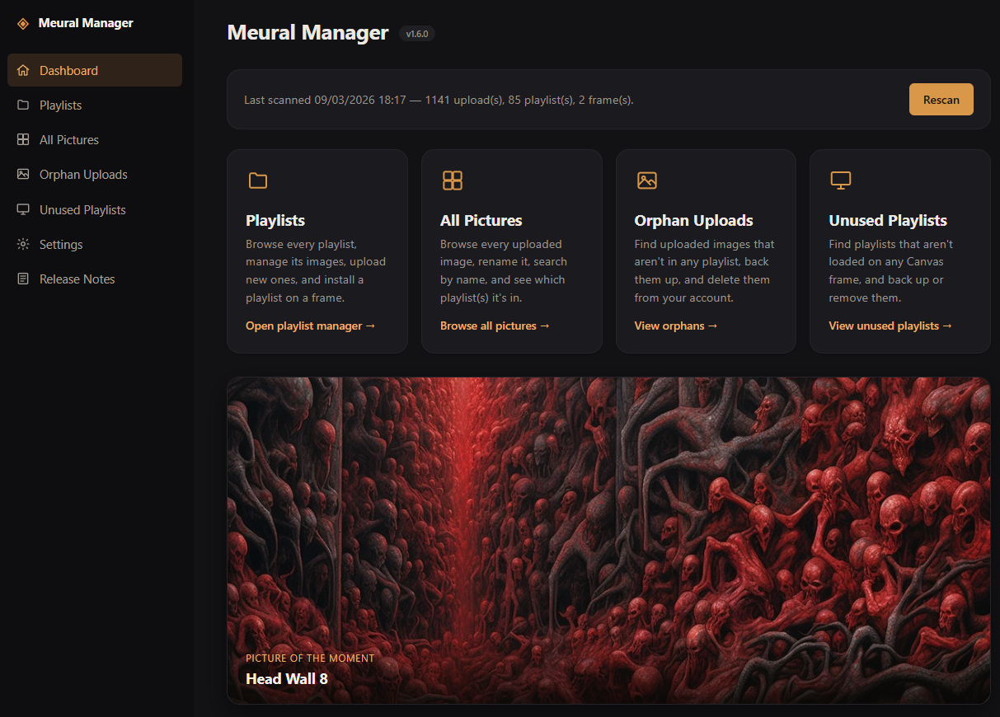
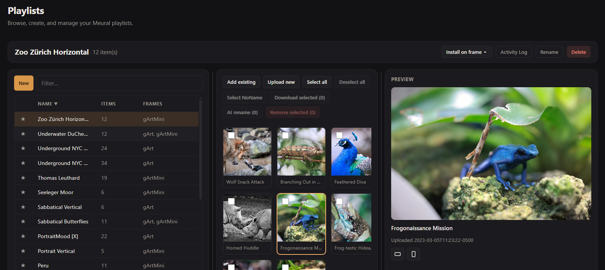

# Meural Manager

A self-hosted web app for managing a Meural ("Canvas" digital art frame) cloud account — the
playlist and cleanup tools the official Meural app doesn't give you.

There's no separate account system — you sign in with your own Meural (Netgear) credentials, the
same ones you use in the Meural app.



## Playlists

The main page: a three-pane browser (playlist list, item grid, preview) for full playlist
management.



- Create, rename, and delete playlists; install one onto a Canvas frame, or remove one from a frame
- Add existing uploads or new local images to a playlist, or remove images from one
- Crop an image to 16:9 or 9:16 non-destructively — a Revert to original button restores it later
- Get an AI-suggested name for an image (Claude or ChatGPT)
- Select multiple images and download them as a ZIP
- Pane sizes are remembered across visits

## All Pictures

Every uploaded image in the account, searchable and sortable, with which playlist(s) it's in —
rename or delete from here too.

## Orphan Uploads

Uploaded images no longer referenced by any playlist (Meural doesn't clean these up when you
delete a playlist that contained them) — back them up as a ZIP, then delete them.

## Unused Playlists

Playlists that exist in the account but aren't loaded on any Canvas frame — same backup-then-
delete flow.

## Frame Remote Control

A toolbar at the bottom of the app for controlling a Canvas frame directly: next/previous image,
power on/off, switching its loaded playlist, and a thumbnail of what's currently showing. Add
another frame (or a second set of controls for the same one) with the `+` button; each has its
own frame picker. Turn it off in Settings if it doesn't apply to you.

Unlike the rest of the app, this talks directly to the frame over your local network instead of
through Meural's cloud, so it needs:

- **A fixed local IP for the frame** — set a DHCP reservation for it in your router. This app
  only learns a frame's IP from an account scan, so if the IP changes afterward the toolbar shows
  that frame as unreachable until the next scan.
- **Network access from wherever this app runs** to that IP — the default Docker setup below
  works out of the box (outbound LAN access isn't blocked by container networking), but a more
  locked-down network setup might need adjusting.

## With Docker

Using docker compose:

```yaml
services:
  meuralmanager:
    image: ghcr.io/geeforceone/meuralmanager:latest
    container_name: meuralmanager
    ports:
      - 8080:8080
    volumes:
      - meuralmanager-keys:/data/keys
      - meuralmanager-cache:/data/cache
    restart: unless-stopped

volumes:
  meuralmanager-keys:
  meuralmanager-cache:
```

or docker run:

```bash
docker run -d --name meuralmanager \
  -p 8080:8080 \
  -v meuralmanager-keys:/data/keys \
  -v meuralmanager-cache:/data/cache \
  --restart unless-stopped \
  ghcr.io/geeforceone/meuralmanager:latest
```

## Build from source instead

```
git clone https://github.com/geeForceOne/MeuralManager.git
cd MeuralManager
docker build -f src/MeuralManager.Web/Dockerfile -t meuralmanager-web .
docker run -d --name meuralmanager -p 8080:8080 meuralmanager-web
```

## Development

```
dotnet build MeuralManager.slnx              # build everything
dotnet run --project src/MeuralManager.Web   # run locally (prints the localhost URL to sign in at)
```

See `CLAUDE.md` for the architecture.

## About this project

This project was developed entirely by [Claude Code](https://claude.com/claude-code), Anthropic's
AI coding agent. It is provided as-is, without warranty of any kind, express or implied. The
author accepts no responsibility or liability for any loss, damage, or account issues arising
from its use. Use at your own risk.

## License

Released under the [MIT License](LICENSE).
